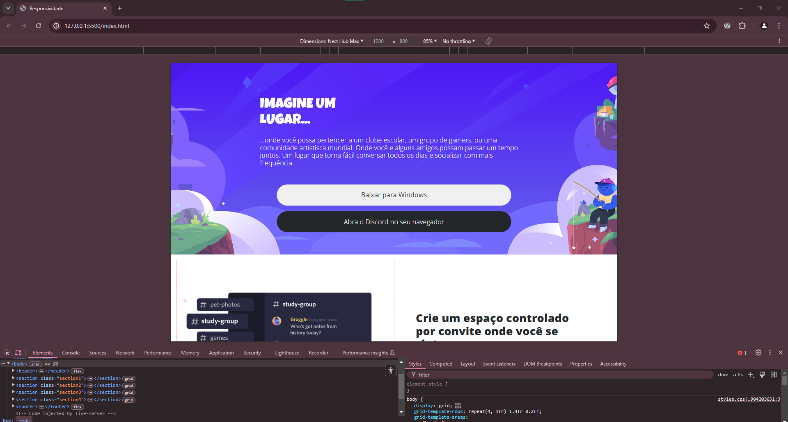

#### Desafio de Projeto
# Construindo um layout Responsivo Para o Discord 📄📱

Este projeto tem como objetivo principal a responsividade da página inicial do Discord. Utilizei tanto **Flexbox** quanto **Grid** neste projeto.  
O design foi baseado no protótipo disponibilizado no [**Figma**](https://www.figma.com/design/NRBYrG5d4DSzObv7dpTqoM/Desafio-Responsividade---DIO?node-id=0-1). 📝

### Ferramenta Utilizada 👾
- **Inspecionar do navegador:** Auxiliou na análise das dimensões para o media queries.

----------------------

----------------------

### Acesse o resultado final desse projeto [**aqui** ✨](https://iisrax.github.io/Discord-Page/)